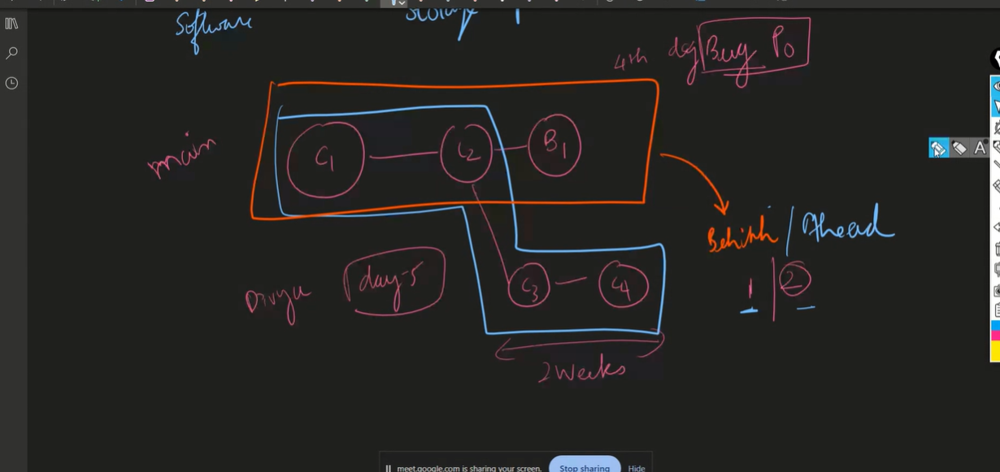

> to enforece coding standards use ESLint

- Kannel is intermediate b/w hardware(processor) and terminal/shell(zsh, bash)

> Linus Torvalds who developed Git as side prj.

> Git -
>
> - you can revert to a previous version if you need to.
> - Git also allows multiple developers to work on the same project at the same time without stepping on each other's toes.
> - maintainces the versions

95 git init
97 git add .
98 git add ./hello.js ./fun.js
99 git commit -m "Start of my git fundamentals"
100 git uncommit--means git reset

> grean means staged
> red color means not staged

- git checkout hash value--- will go to that hash value commit
  -- git chechout - // came back where we are
  > Note: q to quit from git log
  > git checkout master-- will go to master
  > git log - // all latest commits
  > git log -1// only lastet one commit alone
  > git log --author=raga--- to know the ragavs commits
  > git log --author=raga -1 // latest commit that ragav did
  > git log -p // patch-what code we are added and deleted -lines that are added or deleted

113 git log
114 git aa
115 git cm "Git notes"
116 git log
117 git checkout 601253fb4d
118 git checkout -
119 git log
120 git d60b04b716
121 git checkout d60b04b716
122 git checkout 601253fb4d
123 git checkout -
124 git checkout -
125 git checkout -
126 git checkout master
127 git checkout 601253fb4d
128 git checkout master
129 git log -1
130 git log -2
131 git log --author=raga  
gti log --all--to know all the branches.

> github--storing files, installed git inside them.
> git-maintains versions , works without internet, is a software
> github-- stores files
> --gitlab, bit bucket-- are alternatives of github

stage--The purpose is to let you pick which files are going to be commited and which not. Sometime's there's going to be files like personal notes, or programs that you use and should not be included on git and you can always double check what is staged and un staged specific files prior to going for the commit.

> ex boiling the eggs--steps

## commit rules

> logical changes
> small--100 lines in one file -- should not do.
> try to commit as frequently as possible. / make multiple commits(if there is any issue before commiting all we be gone).
> always commit when everything is working.

## Message-

> commit msg should expalin why the changes were done,if you fix any problem why occured how fixed it.

> git reset-- to unstage or if you added some lines but you dont want to commit it .

> git checkout - . / to delete the line or modification you did.

> git revert <commit id> -- it will revert that commit or undo it and also creates a history stating that commit has been reverted
> to even remove history
> git reset --soft HEAD~1// one commit it will reset
> for soft --it will be deleted from commit ,but there in stage, edit
> git reser --hard HEAD-1 --history will be deleted

- s -> pick-axe -search in commits
- git log -S<word> -p --to track regression bug
  - /<word> - heighlight search
  - <space> - pagedown
  - n -next match
  - N -prev match

> github--storing files, installed git inside them.
> git-maintains versions , works without internet, is a software
> github-- stores files
> --gitlab, bit bucket-- are alternatives of github

> git merge branchname
> if there are no extra commits it will not do merge it will do fastforward merge.

# Git

1. what?
2. why--offline
3. How --every one has a copy,even if someone deleted it there will be a copy.

- Distributed-- backup will be there.

4. who-- to control linux he invented git. Linus Torvalds

> if child branch is behide -merge commit
> if child is ahead --not merge commit(fast forward merge)

## sem ver(semantic Version) Rule

> git stash:  
> git stash apply: to recover  
> rebase--to keep the history in a staright line, to do that it has to be fast forward merge.  
> why means we can search the commits easily like using binary search when commits are in stright line.  
> git bisect---to binary search the commits and bugs

> ## 1st commit to run:
>
> - git pull --rebase origin dev

> ## to delete a branch locally

- git branch -D branch name

# Key Terms

> configuration management--git

1. CI -configuration item (code in our case in IT)--> git - files
2. Release Management-branching strategy-> master,staging,dev

- CI/CD --netlify(continuous integration/deploymnet) -- to relase continuously to the customers
- ### Audit -checks and Balances--frequent commits to get audited easily

1.  commits---sign
2.  Blame--use in audit to find out who did it and every line who has done it , aslo do it through 'git lens'

# Configuration Management

1. files
2. Audir

- git blame
- git diff

3. baseline -> safe points, safe unit that point--commits are safe points in git.

   - releases are also safe points(tags)

4. Accountaing: tools to find out who did

- git log
- git blame

5. Change Management -process to maintain

- using Branches
- Creating PR(pull request)

## Key Benefits:

- Easy Tracking- who and why did changes can be tracked
- maintain Code Qualit and have consistency- with PR we are maintaining the code quality and consistency
- reduces the risk of losing the code and reduces errors , becoz has baseline.
- smooth change managemnt

# Relase Management:

- Planning-like every one has to be in office while relasing, and after 2 sprints we will release.
  1.  Brnching Strategy
- Governance
  1. talks about who is in authority
  2. access level of each branch (QA--staging, DEv--dev,master--DepOpsS)
- Scheduling
  1.  sprint
  2.  Agile hwlps with scheld process
- Automation
  1.  CI/CD
  2.  automatically relase will be done to constumer with a merge click--no human errors(copying old code etc)
  3.  ex:circle CI, Netlify,gitlab
- Contigency--Backup
  1. rollback(going back to the older version)

# Netlify---to do CI/CD

- other than netlify-circle CI can do CI/CD
- Jenkins can handle CI/CD

# Software as a Service (SaaS)

> is a cloud-based software solution that users can access over the internet and purchase on a pay-as-you-go basis. Some examples of SaaS include:

- Email and calendaring  
  Office tools  
  Client relationship management systems (CRMs)  
  Customer service and support solutions  
  File storage and sharing  
  E-commerce platforms  
  Project management  
  Examples of popular SaaS products include:  
  Salesforce.  
  Google Workspace apps.  
  Microsoft 365.  
  HubSpot.  
  Trello.  
  Netflix.  
  Zoom.  
  Zendesk.

# IAAS:

> giving Pc for rent  
> Google cloud Provider,AWS,Azure  
> not furnished
> we have to install everything

# SAAS:

> have everything  
> like fully furnished home  
> any app(swiggy ,zomato)  
> dont mantain databases  
> end users

# PAAS:

> they will give the environment, we just need to keep the code
> furnished home (just have to keep Ac,Tv etc)  
> all will be installed like installed os and everything  
> To build any application just need to keep the code  
> used by developers,startups,freklenciers
> ex (render,railway,Natlify,H-eroku,Vercel)
> release management is related to PAAS

# CI/CD:

> Pipeline
> uglifying -- production code

>   
>   
>   
> 

Git and GitHub are related but serve different purposes in the realm of version control and software development. Here’s a breakdown of the differences between them:

### **1. Git:**

- **Type:** Version Control System (VCS).
- **Purpose:** Git is a distributed version control system that tracks changes in files and allows multiple people to work on the same project simultaneously without overwriting each other's work.
- **Functionality:**
  - **Local Version Control:** Git allows you to manage your source code history locally on your machine. It keeps track of all the changes you make to your files in a repository, making it possible to revert back to any previous version.
  - **Branching and Merging:** Git allows you to create branches to work on new features or fixes independently. You can then merge these branches back into the main codebase once the work is complete.
  - **Distributed:** Git does not require a central server. Every user has a full copy of the repository history, making it resilient and enabling offline work.
- **Usage:** Developers use Git commands (e.g., `git init`, `git commit`, `git push`, `git pull`) to manage their projects.

### **2. GitHub:**

- **Type:** Web-based Platform.
- **Purpose:** GitHub is a platform that hosts Git repositories online, providing a collaborative environment for developers to share code and work together on projects.
- **Functionality:**
  - **Repository Hosting:** GitHub provides a remote location (cloud-based) where you can store your Git repositories. This allows multiple people to access, collaborate, and contribute to a project from anywhere in the world.
  - **Collaboration Tools:** GitHub offers tools for collaboration, such as pull requests, issues tracking, code reviews, and project management features. This makes it easier for teams to manage their work and review changes before they are merged into the main codebase.
  - **Social Networking Features:** GitHub has social features like following other users, starring repositories, and contributing to open-source projects, which fosters community engagement.
  - **Integration:** GitHub integrates with many CI/CD pipelines, project management tools, and other software development utilities, making it easier to automate and manage the software development lifecycle.
- **Usage:** Users interact with GitHub through a web interface, as well as through Git commands to push and pull code to and from repositories hosted on GitHub.

### **Key Differences:**

- **Scope:**

  - **Git** is a tool that works locally on your machine to manage version control.
  - **GitHub** is a platform that hosts Git repositories and provides additional features for collaboration and project management.

- **Dependency:**

  - **Git** can be used independently of GitHub.
  - **GitHub** requires Git (or another version control system) to function, as it serves as a host for repositories managed by Git.

- **Access:**
  - **Git** is accessed via command-line interface (CLI) or GUIs (like GitKraken or Sourcetree).
  - **GitHub** is accessed via a web interface, Git CLI (for pushing and pulling), and GitHub-specific desktop applications.

In summary, **Git** is the version control system used for tracking changes in code, while **GitHub** is a platform that facilitates storing, sharing, and collaborating on projects that use Git.
